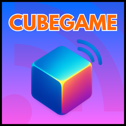

# MNR 2025 - Cube Game

A Godot 4 project developed for the Mostra Nacional de Robótica (MNR 2025). This project implements a UDP-based communication system between a physical cube controller and a digital game interface, allowing players to interact with the game through physical cube movements and button presses.

## Overview

The project consists of two main components:
1. A UDP server (implemented in Godot) that receives and processes input from the physical cube controller
2. A game interface that displays the current cube face and responds to player interactions

### Features

- Real-time UDP communication between physical controller and game
- Face tracking and display
- Button input handling (A and B buttons)
- Smooth animations for face changes
- Connection status monitoring

## Technical Details

The project is built using:
- Godot 4.4.1
- GDScript
- UDP networking for real-time communication

### Project Structure

- `ConnectionManager/`: Handles UDP communication and input processing
- `Scenes/`: Contains the game scenes and UI elements
- `Scripts/`: Contains the game logic and UI scripts
- `Fonts/`: Custom fonts used in the game

## Authors

- [Antônio Meireles](https://github.com/Meidesu)
- [Luis F. Patrocinio](https://github.com/luisfpatrocinio)
- [Ryan Faustino](https://github.com/ryofac/)

## License

This project is licensed under the MIT License - see the [LICENSE](LICENSE) file for details.

## About MNR 2025

The Mostra Nacional de Robótica (MNR) is a national robotics exhibition that showcases innovative projects and research in robotics. This project is being developed as part of the MNR 2025 event, demonstrating the integration of physical and digital interfaces through UDP communication.

## Getting Started

1. Clone the repository
2. Open the project in Godot 4.4.1 or later
3. Run the project
4. Connect the physical cube controller to the same network
5. The game will automatically establish connection and start receiving input

## Contributing

Contributions are welcome! Please feel free to submit a Pull Request. 